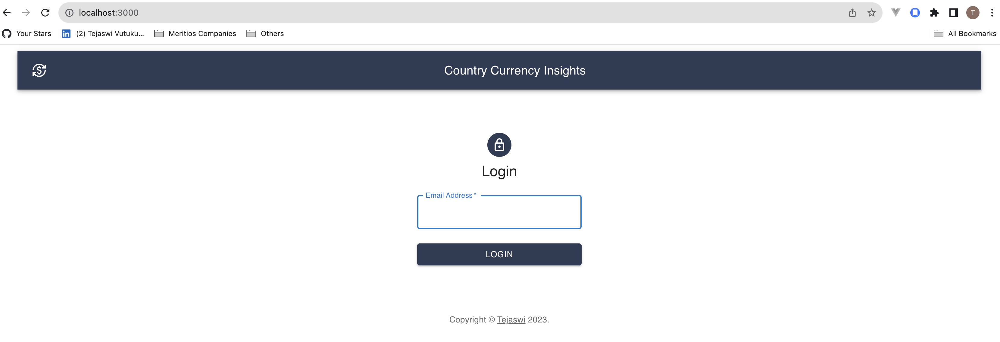
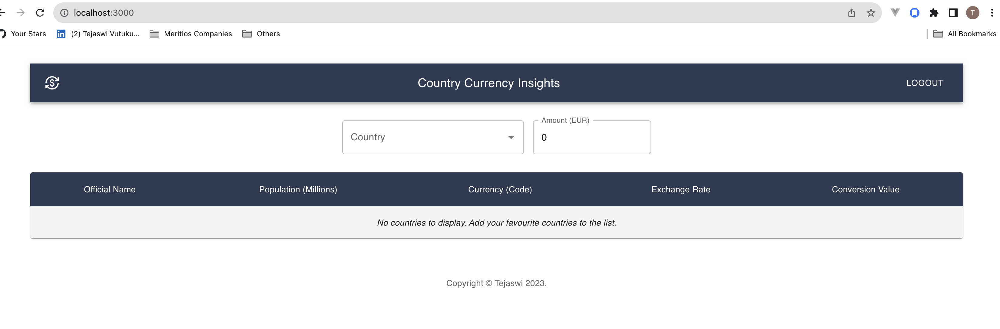
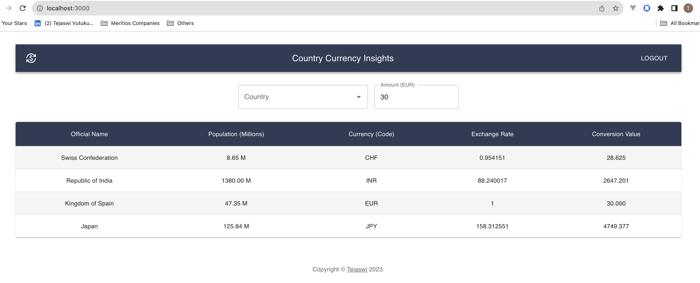

```markdown
```
# COUNTRY CURRENCY INSIGHTS

## Description

The project aims to create a Node.js server and a React.js web interface for looking up country information and performing currency conversions. The server allows users to search for a country by name and retrieve its full name, population, and official currencies along with the current exchange rate to EUR. The web interface provides a user-friendly way to search for countries, add them to a list, and perform currency conversions.

## Technologies Used

The project utilizes the following technologies and frameworks:

- **Node.js**: Runtime environment for the server-side code.
- **Express.js**: Fast and minimalist web application framework for Node.js.
- **Axios**: HTTP client library for making API requests.
- **Node-cache**: In-memory caching module for Node.js.
- **React.js**: JavaScript library for building user interfaces.
- **Material-UI (MUI)**: React UI framework following Material Design guidelines.
- **JSON Web Token (jsonwebtoken)**: Compact means of representing claims between parties.
- **Prettier**: Opinionated code formatter for consistent code style.

## Installation

### Prerequisites

Make sure you have the following software installed on your system:

- Node.js (https://nodejs.org/), npm (Node Package Manager)
- git

### Backend Setup

To install and set up the backend locally, follow these steps:

1. **Clone the repository:**

    ```bash
    git clone https://github.com/tejav27/country-currency-insights.git
    ```

2. **Navigate to the project directory:**

    ```bash
    cd country-currency-insights
    ```

3. **Install Backend Dependencies:**

    ```bash
    cd backend && npm install
    ```

4. **Set up Environment Variables for the Backend:**

    - `FIXER_EXCHANGE_RATES_API_KEY` - Obtain a free API key from [fixer.io](https://fixer.io) by registering an account.
    - `JWT_SECRET_KEY` - Secret key for JSON Web Token authentication.
    
5. **Start the Backend Server:**

    ```bash
    npm start
    ```

### Frontend Setup

To install and set up the frontend locally, please follow the steps below:

1. **Install Frontend Dependencies:**

    ```bash
    cd frontend
    npm install
    ```

    *Note: If you prefer to connect to a backend other than the default one (`localhost:5000`), modify the below property by creating a new file named `.env` in the `frontend` directory. Add the following line to specify your backend server URL:*

    ```
    REACT_APP_BACKEND_API_URL='http://<<your-backend-url>>/api'
    ```
    *Replace `<<your-backend-url>>` with the URL of your desired backend server. This ensures the frontend communicates with the specified backend server.*

2. **Start the Frontend Web Interface:**

    ```bash
    npm start
    ```

These steps will install the necessary dependencies and start the backend server and frontend web interface.

## Usage

To use the project, follow these instructions:

1. Open the app in your web browser at `http://localhost:3000`.
2. Enter a valid email address in the login form. Any valid email address will be accepted.
3. Use the auto-complete search bar to search for a country by name.
4. Select a country from the search results to add it to the list of your favourites.
5. The country will be added to the list with its official name, population, currency code, and exchange rate to EUR.
6. Enter an amount in EUR in the input box for currency conversion.
7. The converted amount will be displayed next to each country in the list.
8. You may logout after your activity. Login is valid for 30 mins post which you have to login again.

## APIs Used

The project utilizes the following external APIs, employing appropriate caching strategies for optimized performance:

- [restcountries.com](https://restcountries.com) - Used for country lookup and general information.
- [fixer.io](https://fixer.io) - Used for exchange rates. Requires a free API key obtained by registering an account.

## Endpoints

The backend server exposes the following endpoints:

- `POST /login` - Endpoint for obtaining a valid JWT.
- `GET /countries` - [Authentication required] Endpoint for searching and retrieving country information.
- `GET /countries/:name` - [Authentication required] Endpoint for retrieving detailed information about a specific country.

To access the protected endpoints, include the following in the headers of your request:
```
Authorization: Bearer <token>
```

## Screenshots





## Demo

Click [this link](https://drive.google.com/file/d/10oekzZAcG5MX8fFKRehrIZyPtSh8EGng/view?usp=sharing) to watch a **_live demo_** showcasing the features of the **_Country Currency Insights_** Web App.

## Potential Improvements

- **Documenting the app's endpoints** using OpenAPI spec or a similar standard for enhanced API documentation and communication.

- Implement a **more secure login** system, incorporating password encryption or enabling social logins for a streamlined authentication process.

- Integrate a **registration feature** to restrict access to registered users, requiring the implementation of forms, validations, and a database for user management.

- The caching mechanism may need to be upgraded to a more sophisticated solution if the data storage requirements increase, as the current in-memory cache (node-cache) may not suffice for larger datasets.

- Given the current simplicity of the application, the use of **Context API** suffices for passing data between components. If the application's complexity grows, integrating a state management library like Redux may be beneficial.

- Improve user experience with features such as the ability to 'delete from the list,' sort and pagination of search results, help icons/text for user guidance, enhanced styling for a more polished interface, and auto-clear functionality for the search bar.

- Enhance the request response logging, particularly for external calls, to gain deeper insights into the app's interactions with external services.

- Implement a **more robust build and package solution** to streamline the deployment process.

```